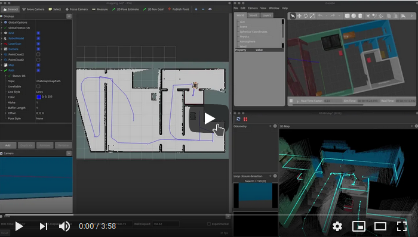

# Robotics Software Engineer Nanodegree Program

## Project 4/5: Map My World

[](https://youtu.be/MU3ksyzKBbE)

[//]: # (Image References)

[image1]: ./documentation/gazebo.png "Gazebo"
[image2]: ./documentation/frames.png "TF Frames"
[image3]: ./documentation/rosgraph.png "Graph"
[image4]: ./documentation/rviz.png "Localization"
[image5]: ./documentation/rtab-map.png "Localization"
[image6]: ./documentation/database.png "Navigation"


### Dependencies:
#### - RTAB-Map ROS
This package is a ROS wrapper of RTAB-Map (Real-Time Appearance-Based Mapping), a RGB-D SLAM approach based on a global loop closure detector with real-time constraints.

`sudo apt install ros-melodic-rtabmap-ros`

#### - Teleop package
Generic keyboard teleop for twist robots.

`sudo apt install ros-melodic-teleop-twist-keyboard`

### Project build instrctions:
1. Clone this repo inside the `src` folder of a catkin workspace, make sure that you are cloning the saved map as Git LFS file, too:
`git clone https://github.com/dudasdavid/Udacity-Robotics-SLAM`
2. Build workspace: `catkin_make`
3. Source environment: `source devel/setup.bash` 
4. Start the Gazebo simulation and RViz: `roslaunch my_robot world.launch`
5. Start the RTAB-Map SLAM and the visualizer package: `roslaunch my_robot mapping.launch`
6. Start the Teleop package: `roslaunch my_robot teleop.launch`
7. Optional: start the navigation package: `roslaunch my_robot navigation.launch`

### Summary of Tasks:
Map the environment with RTAB-Map SLAM package using simulated Lidar and RGBD camera. During the mapping there should be at least 3 loop closures.
This project is based on the `my_robot` package of Project 3:

`https://github.com/dudasdavid/Udacity-Robotics-RobotLocalization`.

### Launching the project
After successfully start the simulation, mapping and teleop packages you should see the following graph after executing `rqt_graph`:
![alt text][image3]
And the following TF tree after executing `rosrun rqt_tf_tree rqt_tf_tree`:
![alt text][image2]

### Mapping
1) The robot's simulated environment in Gazebo is the same as in the previous project:
![alt text][image1]
2) After manually driving the robot through the environment we can visualize the map (2D occupancy grid) of the environment and even the robot's path:
![alt text][image4]
3) In the visualizer tool of RTAB-Map we can see the RGBD pointcloud of the environment:
![alt text][image5]


### Evaluating the RTAB-Map database
After a successful mapping we can evaluate the database with RTAB-Map's database viewer, that can be started with the following command:

`rtabmap-databaseViewer ~/catkin_ws/src/Udacity-Robotics-SLAM/my_robot/database/rtabmap.db`
![alt text][image6]

Once open, we will need to add some windows to get a better view of the relevant information, so:

* Say yes to using the database parameters
* View -> Constraint View
* View -> Graph View

We can make sure that there were more than 3 loop closures during the mapping using the bottom left information:

`(283, 0, 29, 0, 0, 0, 0, 0, 0) Links(N, NM, G, LS, LT, U, P, LM, GR)`

Where G means the number of Global Loop Closures. The codes stand for the following: `Neighbor`, `Neighbor Merged`, `Global Loop closure`, `Local loop closure by space`, `Local loop closure by time`, `User loop closure`, and `Prior link`.


### Project structure:
```bash
tree
.Udacity-Robotics-SLAM                      # Map My World Project
├── README.md
├── documentation                           # Project documentation
│   ├── database.png
│   ├── frames.png
│   ├── gazebo.png
│   ├── rosgraph.png
│   ├── rtab-map.png
│   ├── rviz.png
│   └── video.png
└── my_robot                                # my_robot node
    ├── CMakeLists.txt                      # Link libraries
    ├── config                              # move_base config files
    │   ├── base_local_planner_params.yaml
    │   ├── costmap_common_params.yaml
    │   ├── global_costmap_params.yaml
    │   └── local_costmap_params.yaml
    ├── database                            # Recorded database of the map
    │   └── rtabmap.db
    ├── launch
    │   ├── localization.launch             # Start RTAB-Map in localization mode
    │   ├── mapping.launch                  # Start RTAB-Map in mapping mode
    │   ├── multisession_mapping.launch     # Start RTAB-Map in mulisession mapping mode
    │   ├── navigation.launch               # Start the move_base navigation
    │   ├── robot_description.launch        # Robot URDF description
    │   ├── teleop.launch                   # Start the teleop package
    │   └── world.launch                    # Initialize robot in Gazebo environment
    ├── meshes                              # Custom robot meshes
    │   ├── chassis.dae
    │   ├── chassis.SLDPRT
    │   ├── chassis.STEP
    │   ├── hokuyo.dae
    │   ├── wheel.dae
    │   ├── wheel.SLDPRT
    │   └── wheel.STEP
    ├── package.xml
    ├── rviz                                # RViz config file for the project
    │   └── mapping.rviz
    ├── urdf                                # Robot URDF description
    │   ├── my_robot.gazebo
    │   └── my_robot.xacro
    └── worlds                              # Simulated world in Gazebo
        ├── empty.world
        └── MyWorld.world
```

### Remarks:
* Project was built on Ubuntu 18.04 with ROS Melodic
* Lidar range is set to 360 degree
* Multisession mapping is not part of project scope
* Map database was added as Git LFS file

